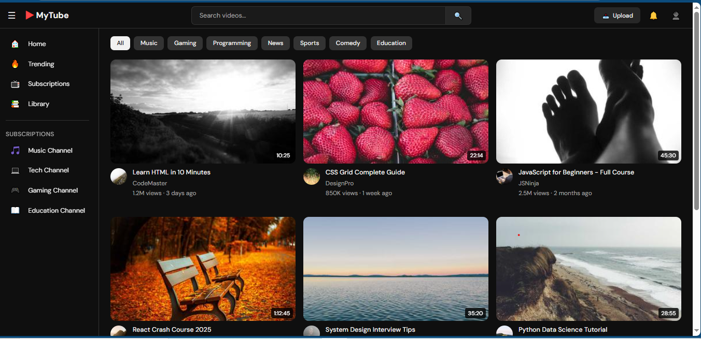

# 🎬 HM YouTube

HM YouTube is a **responsive YouTube-inspired web interface** built using **HTML, CSS, and JavaScript**.
The project recreates the layout of a modern video streaming platform, including video thumbnails, a sidebar navigation menu, and a search interface while focusing on clean UI design and responsiveness.

---

## 🚀 Live Demo

🔗 **https://hmyoutube.netlify.app/**

---

## 📸 Screenshot

---

## ✨ Features

* YouTube-style homepage layout
* Video thumbnail grid
* Sidebar navigation menu
* Search bar interface
* Responsive design for different screen sizes
* Clean and simple UI

---

## 🛠️ Technologies Used

* **HTML5**
* **CSS3**
* **JavaScript**

---

## 🎯 Purpose

This project was created to practice **front-end web development** and understand how video streaming platforms structure their user interface and layout.

---
